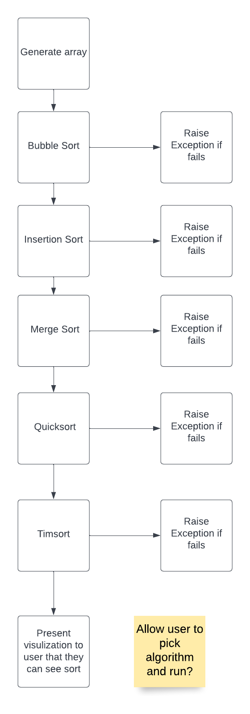

# Contents
* [**User Experience UX**](<#user-experience-ux>)
    *  [User Stories](<#user-stories>)
    * [Design](<#design>)
    * [Wireframes](<#wireframes>)
* [**Features**](<#features>)
    * [Current Features](<#current-features>)
    * [Future Features](<#future-features>)
* [**Technologies Used**](<#technologies-used>)
* [**Testing**](<#testing>)
    * [Validation](<#validation>)
    * [Testing User Stories from User Experience](<#testing-user-experienece>)
* [**Deployment**](<#deployment>)
* [**Credits**](<#credits>)
    * [**Content**](<#content>)
*  [**Acknowledgements**](<#acknowledgements>)

## Reminders

* Your code must be placed in the `run.py` file
* Your dependencies must be placed in the `requirements.txt` file
* Do not edit any of the other files or your code may not deploy properly

[View the live project here.]()

This project looks to create algortihms to sort an array and to present user with visualizations of process in real time while positioning elements in apporpriate list position.

<h2 align="center"></h2>

## User Experience (UX)

-   ### User stories

    -   #### First Time Visitor Goals

    -   #### Returning Visitor Goals

    -   #### Frequent User Goals
    
*   ### Wireframes

    The flow for how the application operates was mapped out on lucidcharts

    * Highlevel overview wireframe image  
     

    * lower layer 
      

    * Micro 
    

[Back to top](<#contents>)

## Features

### Current Features

### Future Features

[Back to top](<#contents>)

## Technologies Used

### Languages Used

-   [Python](https://en.wikipedia.org/wiki/Python_(programming_language))

### Frameworks, Libraries & Programs Used

[Back to top](<#contents>)

## Testing

### Validation

### Testing User Stories from User Experience (UX) Section

### Testing User Experienece

-   #### First Time Visitor Goals

-   #### Returning Visitor Goals

-   #### Frequent User Goals

### Further Testing

### Known Bugs

- Bug introduced in the merge_arrays(). It was caused by defining the length of firs & second array as variables. Used PythonTutor to debug code in console and was able to address issue by removing vars.

[Back to top](<#contents>)

## Deployment

## Creating the Heroku app

When you create the app, you will need to add two buildpacks from the _Settings_ tab. The ordering is as follows:

1. `heroku/python`
2. `heroku/nodejs`

You must then create a _Config Var_ called `PORT`. Set this to `8000`

If you have credentials, such as in the Love Sandwiches project, you must create another _Config Var_ called `CREDS` and paste the JSON into the value field.

Connect your GitHub repository and deploy as normal.

## Constraints

The deployment terminal is set to 80 columns by 24 rows. That means that each line of text needs to be 80 characters or less otherwise it will be wrapped onto a second line.

[Back to top](<#contents>)

## Credits

### Code

### Content

-   All content was written by the developer.

### Acknowledgements

The app was completed as a Portfolio 3 Project for the Full Stack Software Developer (e-Commerce) Diploma at the [Code Institute](https://codeinstitute.net/). I would like to thank my mentor XXXXXXXXX, my class mates, the Slack community, and all at the Code Institute for their help and support. 

Also to my friends and family who helped test site & provide feedback and most importantly patient with me during this time!

[Back to top](<#contents>)